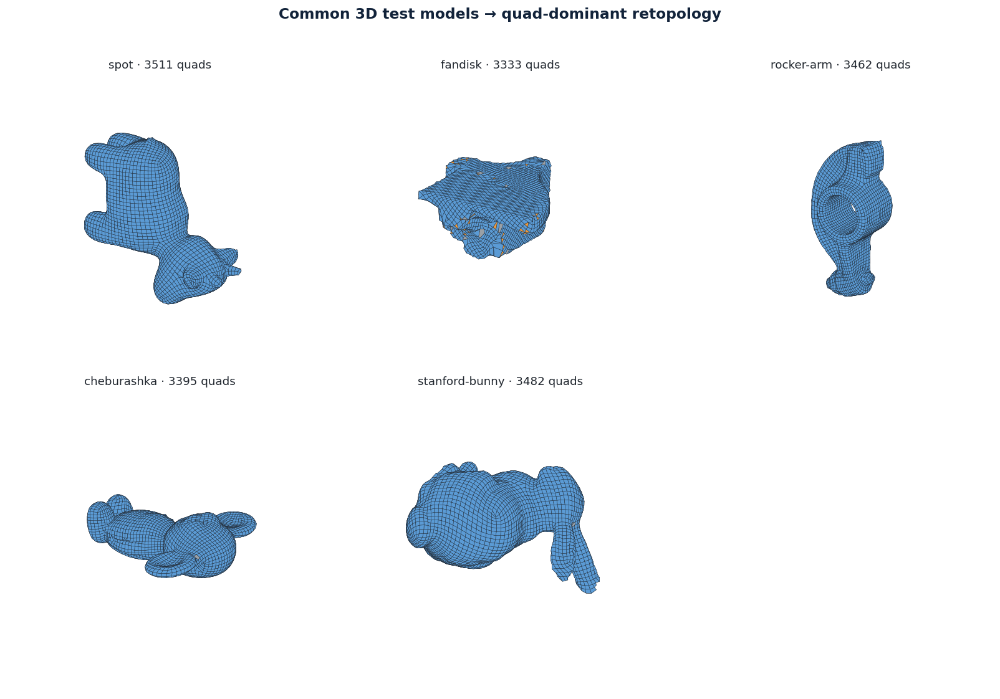
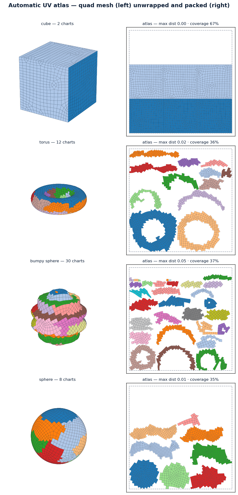

# CyberRemesher

Quad remeshing, stroke-based retopology, UV editing, and baking — one pure C++20 engine for
desktop and mobile, with CPU/CUDA/OpenCL/Metal compute backends.

Re-implements and improves on [AutoRemesher](https://github.com/huxingyi/autoremesher)
(automatic field-guided quad remeshing) and the workflow pioneered by CozyBlanket
(manual retopology / UV / bake on tablets). Specifications live in [`openspec/`](openspec/) —
see `openspec/changes/bootstrap-v1-platform/` for the founding change (proposal, design,
capability specs, task plan).

### Auto-retopology

Triangle→quad remeshing via `RemeshParams.quad_method`, clean-room and permissively
licensed. The default **`quad-cover`** — a QuadCover seamless-UV isoline extractor —
**beats [QuadriFlow](https://github.com/hjwdzh/QuadriFlow) on both median quad angle
and irregular-vertex count** across the organic corpus (spot, rocker-arm,
stanford-bunny), and routes crease-heavy CAD parts to a feature-aware solver. Other
strategies: **`field-aligned`** (max-matching over a smoothed cross field, ~95%+
quad-dominance, strongest on box/CAD geometry), **`instant-meshes`** (Instant-Meshes-style
position-field extractor), and **`integer`** (experimental integer parametrization).



<sub>Real scanned / CAD models → quad-dominant retopology · <code>examples/09_test_models.py</code></sub>

Every strategy feeds a pure-quad path (subdivision + surface-projected relaxation)
for a 100%-quad result. `examples/10_vs_reference.py` and `examples/11_benchmark.py`
score the output side-by-side against QuadriFlow and AutoRemesher — e.g. the
stanford-bunny at median **83° / 3% irregular** vs QuadriFlow's 80° / 6% and
AutoRemesher's 75° / 14%. GPL sources (AutoRemesher, its QuadCover/CoMISo path) were
idea references only, never copied — see [`THIRD_PARTY_NOTICES.md`](THIRD_PARTY_NOTICES.md).

### Automatic UV atlas

Beyond the interactive UV editor (hand-drawn seams, LSCM unwrap, packing,
distortion overlay), the engine has a one-call automatic path: `Mesh.unwrap_atlas`
(C: `cyber_uv_atlas`). It seams the mesh into normal-coherent charts, merges
adjacent charts (first any that still share a normal cone — free, no distortion
rise; then a looser distortion-bounded pass that folds developable regions
together, e.g. a cube's six faces into two flat strips), LSCM-unwraps each chart
conformally, re-orients each chart to its minimum-area bounding box, skyline-packs
them into the unit square, and writes the per-corner UV attribute —
mesh in, packed atlas out, no manual seams. It returns chart count, conformal
(angle) distortion, flip count and packing efficiency. On the remeshed quad output
it holds angular distortion under ~0.05 (conformal error, 0 = angle-preserving)
with no flipped charts; min-area re-orientation roughly doubles usable coverage on
box-like meshes (45°-diamond faces → axis-aligned squares). `examples/14_uv_atlas.py`
renders the quad mesh next to its packed atlas, tinted by chart, and
`examples/15_uv_vs_xatlas.py` benchmarks it against [xatlas](https://github.com/jpcy/xatlas)
(the open reference): CyberRemesher matches or beats xatlas on chart count while
holding ~2× lower conformal distortion; xatlas's polygon packer still fits its
charts tighter (higher coverage), the one remaining gap.



<sub>Each quad mesh (left) auto-seamed, unwrapped, re-oriented, and packed into a UV atlas (right), tinted by chart · <code>examples/14_uv_atlas.py</code></sub>

## Layout

```
apps/            desktop shell, mobile shells, headless CLI
src/app/         document model, tools, undo (toolkit-free)
src/render/      viewport renderer (Metal | Vulkan)
src/accel/       compute backends: cpu | metal | cuda | opencl
src/core/        mesh kernel, io, remeshing pipeline, uv, bake
tests/           unit + property + golden regression tests
thirdparty/      vendored permissive dependencies (manifest.json)
```

## Build

Requires CMake ≥ 3.24, Ninja, and a C++20 compiler. A [`just`](https://github.com/casey/just)
task runner mirrors the sibling CyberdyneCorp libraries (SciPP / NumPP):

```sh
just build      # configure + build (library, CLI, tests)
just test       # build + run the full suite
just debug      # ASan/UBSan build
just gcc        # build + test with GCC
just spec       # validate the OpenSpec changes
just ci         # local CI: test + gcc + spec
just gpu-detect # probe CUDA / OpenCL / Metal
just clean      # remove build dirs
```

`just` is a thin wrapper over the CMake presets, which you can also drive directly:

```sh
cmake --preset cpu-headless      # core + accel + CLI + tests, no GPU SDK needed
cmake --build --preset cpu-headless
ctest --preset cpu-headless
```

Other presets: `cpu-headless-debug` (ASan/UBSan), `macos-metal`, `linux-cuda`,
`windows-cuda`, `ios`, `android`.

The `cpu-headless` preset requests `-DCYBER_WITH_QUADCOVER=ON`, which vendors and
compiles an in-process Geogram QuadCover solver (~102 sources, a one-time build
cost). That is the field that lets the default `quad-cover` quadrangulator **beat
QuadriFlow on median quad angle and irregular-vertex count** on organic meshes. It
needs **OpenMP + TBB**; where they are absent (a minimal CI runner, a macOS box
without `libomp`) the build **auto-falls-back to the dependency-free native
seamless-UV solver** (a few degrees lower median, still fully functional and
portable) — so `-DCYBER_WITH_QUADCOVER=ON` never hard-fails. Override with
`-DCYBER_WITH_QUADCOVER=OFF` to skip it outright; mobile presets (`ios`/`android`)
leave it off.

### Use as a library

`just install` (or `cmake --install`) installs a `find_package(CyberRemesher)`
CONFIG package — the self-contained C ABI shared library plus its header. Consume
it from another CMake project the same way as the sibling CyberdyneCorp libraries:

```cmake
find_package(CyberRemesher CONFIG REQUIRED)
target_link_libraries(your_app PRIVATE cyber::capi)   # + #include <cyber_capi.h>
```

The `cyber::capi` target carries the include path and links the versioned
`libcyber_capi.so`; the C++ core, quadrangulator, UV, and the in-process Geogram
solver are all baked into it, so the package has no transitive dependencies. In
the same build tree, `add_subdirectory()` also exposes the `cyber::*` targets
(`cyber::core`, `cyber::uv`, …). Python bindings live in `python/cyberremesh/`.

## Development

- Specs first: medium/large changes go through OpenSpec (`openspec list`).
- `python3 tools/license_audit.py` — dependency license gate (permissive only).
- `.clang-format` / `.clang-tidy` are enforced in CI.
