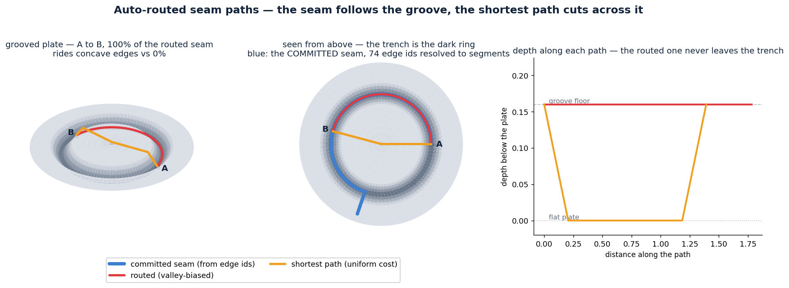
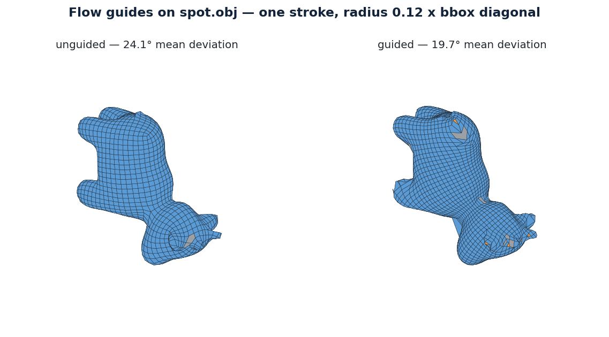
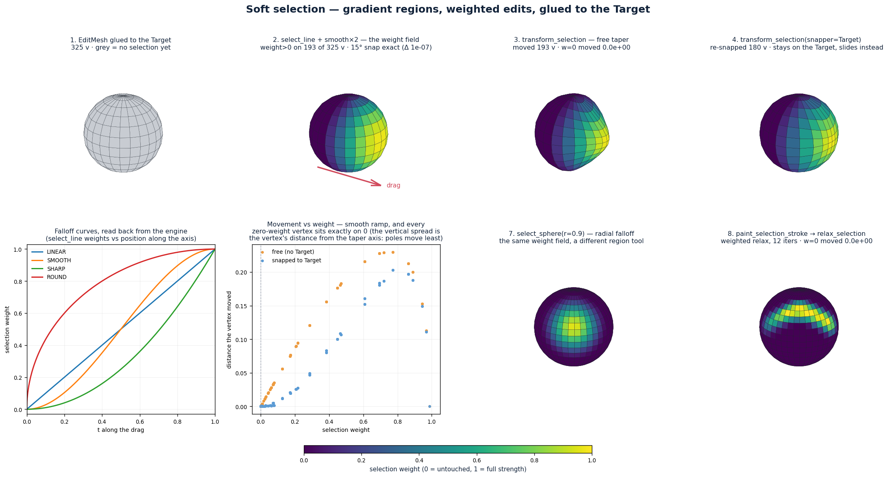
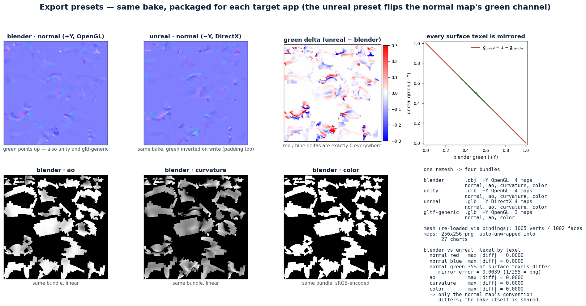
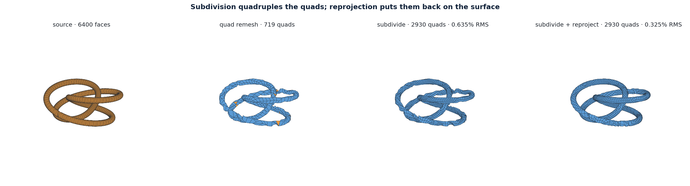
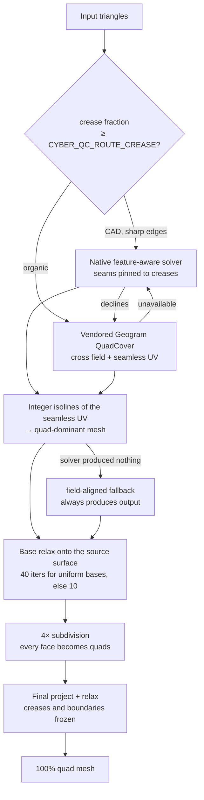
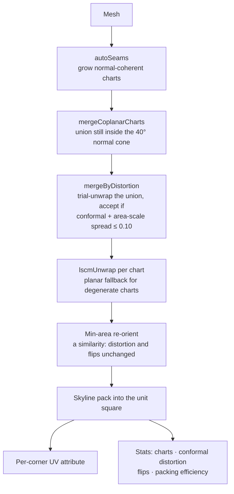

# CyberRemesher

Quad remeshing, stroke-based retopology, UV editing, and baking — one pure C++20 engine for
desktop and mobile, with CPU/CUDA/OpenCL/Metal compute backends.

Re-implements and improves on [AutoRemesher](https://github.com/huxingyi/autoremesher)
(automatic field-guided quad remeshing) and the workflow pioneered by CozyBlanket
(manual retopology / UV / bake on tablets). Specifications live in [`openspec/`](openspec/) —
see `openspec/changes/archive/2026-07-22-bootstrap-v1-platform/` for the founding change
(proposal, design, capability specs, task plan). Completed changes are archived there and
their requirements folded into `openspec/specs/`, which is the current contract.

### Auto-retopology

Triangle→quad remeshing via `RemeshParams.quad_method`, clean-room and permissively
licensed. The default **`quad-cover`** is a QuadCover seamless-UV isoline extractor,
and it routes crease-heavy CAD parts to a feature-aware solver.

Against [QuadriFlow](https://github.com/hjwdzh/QuadriFlow) at matched counts, measured
2026-08-24 (`examples/11_benchmark.py`), **we win on validity and, with the default
solver selection, lose on angle quality**:

| model | median angle° | irregular % | topo defects |
|---|---|---|---|
| spot | **82** vs 81 | **2** vs 3 | 0 vs 0 |
| rocker-arm | 83 vs **84** | 1 vs 1 | 0 vs 0 |
| fandisk | 80 vs **85** | 2 vs **1** | 0 vs 0 |
| cheburashka | 78 vs **83** | 4 vs **3** | 0 vs 0 |
| stanford-bunny | 76 vs **82** | 5 vs **4** | **0** vs 80 |
| cube (synthetic, flat CAD) | **90** vs 12 | **1** vs 20 | **0** vs 722 |

We beat QuadriFlow on *both* median angle and irregular count on **1 of the 5
community models** (spot), plus the synthetic flat-CAD cube — where the gap is not
close: QuadriFlow returns a 12° median and 722 topological defects on a shape it
tears, and we return 90° and none.

**The table above was measured on the pre-2026-08-24 routing, which sent every one
of these models to the vendored Geogram field — the worse of our two solvers on
all but one of them.** With the corrected routing the same models score spot 85/2%,
cow 84/4%, fandisk 83/3%, cheburashka 82/4% and stanford-bunny 80/4%, against
rocker-arm's 74/3%; the table will be re-recorded against QuadriFlow on the next
benchmark pass. Choosing per input by measuring both solvers, rather than by a
threshold that provably cannot separate these cases, is still open work — see the
2026-08-24 entry in [`docs/ROADMAP.md`](docs/ROADMAP.md).

**Topological validity is the claim that holds across the board**: zero defects on
every model, 6 of 6, where QuadriFlow has 80 on the bunny and 722 on the cube. If
you need output you can hand to a subdivision surface without repair, that is the
number that matters. If you need the tightest median angle on organic scans,
QuadriFlow is still ahead on four of these five.

Other strategies: **`field-aligned`** (max-matching over a smoothed cross field, ~95%+
quad-dominance, strongest on box/CAD geometry), **`instant-meshes`** (Instant-Meshes-style
position-field extractor), and **`integer`** (experimental integer parametrization).


<sub>Real scanned / CAD models → quad-dominant retopology · <code>examples/09_test_models.py</code></sub>

Twenty-one runnable examples drive the engine through the Python binding and
render what they do; [`examples/README.md`](examples/README.md) indexes them,
and `examples/run_all.py` runs the lot into a stitched gallery.

Every strategy feeds a pure-quad path (subdivision + surface-projected relaxation)
for a 100%-quad result. `examples/10_vs_reference.py` and `examples/11_benchmark.py`
score the output side-by-side against QuadriFlow and AutoRemesher. Both fetch and
build their reference on first run, so the table above is reproducible with
`python3 examples/11_benchmark.py` — the AutoRemesher arm did not rebuild on the
machine those numbers came from, so its column is absent rather than stale.
AutoRemesher (MIT) and the Geogram subset
(BSD-3-Clause) it carries are fetched on demand and compiled into the shipped
binaries as the optional QuadCover field solver; the Instant Meshes extraction
stage is a clean-room reimplementation with no code copied. Every licence and
copyright notice is reproduced in
[`THIRD_PARTY_NOTICES.md`](THIRD_PARTY_NOTICES.md), which ships inside each
release artifact.

### Automatic UV atlas

Beyond the interactive UV editor (hand-drawn seams, LSCM unwrap, packing,
distortion overlay), the engine has a one-call automatic path: `Mesh.unwrap_atlas`
(C: `cyber_uv_atlas`). It seams the mesh into normal-coherent charts, merges
adjacent charts (first any that still share a normal cone — free, no distortion
rise; then a looser distortion-bounded pass that folds developable regions
together, e.g. a cube's six faces into two flat strips), LSCM-unwraps each chart
conformally, re-orients each chart to its minimum-area bounding box, skyline-packs
them into the unit square, and writes the per-corner UV attribute —
mesh in, packed atlas out, no manual seams. It returns chart count, conformal
(angle) distortion, flip count and packing efficiency — where `packed_area` is
the fraction of the UV square the chart *geometry* covers (the bounding-box
fraction is reported separately as `packed_box_area`). On the remeshed quad output
it holds angular distortion under ~0.05 (conformal error, 0 = angle-preserving)
with no flipped charts; min-area re-orientation roughly doubles usable coverage on
box-like meshes (45°-diamond faces → axis-aligned squares). `examples/14_uv_atlas.py`
renders the quad mesh next to its packed atlas, tinted by chart, and
`examples/15_uv_vs_xatlas.py` benchmarks it against [xatlas](https://github.com/jpcy/xatlas)
(the open reference): CyberRemesher matches or beats xatlas on chart count while
holding ~2× lower conformal distortion; xatlas's polygon packer still fits its
charts tighter (higher coverage), the one remaining gap.


<sub>Each quad mesh (left) auto-seamed, unwrapped, re-oriented, and packed into a UV atlas (right), tinted by chart · <code>examples/14_uv_atlas.py</code></sub>

### Auto-routed seam paths

Between "draw every seam edge by hand" and "let the atlas decide" sits the UV
Path tool (`SeamPath` in Python/Swift, `cyber_seam_path_*` in C). You place
waypoints; the engine routes a least-cost edge path between consecutive ones
with a cost model that discounts feature-tagged and concave (valley) edges, so
a two-click hop **follows the groove** instead of cutting the geodesic shortcut
across flat surface. This is what makes seaming spiral-looped auto-retopo
output tractable — exactly the layouts where no traceable edge loop exists.

The pending path stays editable: any waypoint can be dragged
(`move_waypoint_to` snaps it to the nearest vertex) or deleted, and an edit
re-routes **only the segments adjacent to it** — the rest of the path keeps its
route, and each segment's `segment_revision` counter tells a viewport exactly
what to redraw. `commit` marks the route into a `SeamSet` — the one seam model,
the same `mark`/`erase`/`sew` set a hand-drawn seam edits, so island
computation, unwrap and stitch treat a routed seam exactly like a hand-marked
one — and arms a resume marker so the next waypoint continues from the
last committed point. Committing returns the edge ids it newly marked: that
list is the undo record (`revert_commit`), and edges that were already seams
are never in it, so they survive the undo. Dropping the resume marker only
forgets where to continue; it never touches a committed seam.

```python
seams, path = SeamSet(), SeamPath(mesh)
path.add_waypoint(a); path.add_waypoint(b)
path.move_waypoint_to(1, (x, y, z), radius=0.5)   # re-routes one segment
undo = path.commit(seams)                          # -> newly seamed edge ids

mesh.unwrap_seams(seams)                           # parameterize along YOUR cuts
mesh.stitch_seams(seams, undo)                     # ...or sew them back shut
```



<sub>A to B across a grooved plate: the routed seam rides concave edges for 100% of its length and never leaves the trench, where the uniform-cost shortest path climbs straight out and back in · <code>examples/20_seam_paths.py</code></sub>

`Mesh.unwrap_seams` (C: `cyber_uv_unwrap_seams`) is the counterpart to the
automatic atlas: `unwrap_atlas` decides its own cuts and ignores what you
marked, while this one takes the seam set you built — by hand or by committing a
routed path — cuts the mesh into islands at exactly those edges, unwraps each,
re-orients and packs them, and reports through the same `AtlasResult`. An empty
seam set means *do not cut*, never *decide for me*. `Mesh.stitch_seams`
(`cyber_uv_stitch_seams`) is the inverse: it removes the given edges from the
set and welds the corners across each one.

### Flow guides and painted density

Where the automatic field puts loops somewhere you disagree with, you draw over
it instead of fighting the parameters. A `FlowGuide` is an ordered polyline on
or near the surface; the cross field is softly biased toward the stroke's
tangent within `radius`, scaled by `strength`. It is a bias, not a constraint —
the guide competes with the smoothness term rather than overriding it, so the
influence decays outside the radius instead of leaving a hard edge at it.

```python
from cyberremesh import FlowGuide, RemeshParams, remesh

guide = FlowGuide(points=stroke_xyz, strength=1.0, radius=0.12 * bbox_diagonal)
out = remesh(source, RemeshParams(target_quad_count=3000), guides=[guide])
```

Measured as mean angular deviation of the extracted quad edges from the guide
tangent inside the radius, folded mod 90° so a random field scores 22.5°:
**10.98° mean and 13.77° worst across six runs** on the community corpus,
against a ≤15° gate. `examples/17_flow_guides.py` is the artifact those numbers
come from — it prints what it measures, met or not.



<sub>One stroke at 0.12 × bbox diagonal — unguided 13.5° mean deviation, guided 10.4° · <code>examples/17_flow_guides.py</code></sub>

Guides force the native seamless solver: the vendored Geogram `quad_cover` has
no hook for either a guide or a painted density, so routing a guided island
there would silently drop the input. If that fallback ever happens anyway
(`CYBER_QC_NO_NATIVE`), the run **reports the guidance as unhonoured and names
the variable** rather than returning an unguided mesh that looks like a
successful one.

### Soft selection

The manual-retopology stage has tweak, relax and rigid transforms; soft
selection adds the gradient region on top. A line, sphere or painted stroke sets
a per-vertex weight, four falloff curves shape it (`LINEAR`, `SMOOTH`, `SHARP`,
`ROUND`), and the weighted transform and relax consume it.

The part worth knowing is that the Target re-projection happens **inside** the
transform. Passing a `Snapper` glues the moved vertices to the sculpt in the
same call, so there is no snap-all cleanup pass afterwards — which would drag
the untouched vertices too. Vertices at weight 0 are never moved and never
re-snapped, and that is asserted rather than assumed.



<sub>The weight field painted on the mesh, the same taper run free and snapped to the Target, the four falloff curves read back out of the engine, and per-vertex movement against weight — where zero-weight geometry sits exactly on 0 · <code>examples/16_soft_selection.py</code></sub>

### Per-DCC export presets

`--preset` turns a run into a ready-to-hand-off bundle instead of a bare mesh:
remesh → auto-UV → bake the preset's map set → write the mesh and its maps under
the preset's naming, color-space and normal conventions.

```sh
cyberremesh --input sculpt.obj --output out/hero.obj --preset blender \
            --report out/report.json
# out/hero.obj  hero_normal.png  hero_ao.png  hero_curvature.png  hero_color.png
```

Four built-ins ship — `blender`, `unity`, `unreal`, `gltf-generic` (list them
with `--list-presets`). They differ where the target apps actually differ: only
`unreal` uses the DirectX green-channel convention (green points down), and only
`gltf-generic` drops curvature, because glTF 2.0 core has no slot for it. Color
is the one sRGB-encoded map in every preset; normal, AO and curvature carry data,
not appearance, and a gamma curve on them is a bug in every target app.

A preset is versioned JSON, so `--preset ./mine.json` behaves exactly like a
built-in:

```json
{ "schemaVersion": 1, "name": "mine", "resolution": 2048,
  "namingPattern": "{basename}_{map}.{ext}",
  "maps": ["normal", "ao", {"map": "color", "colorSpace": "srgb", "suffix": "basecolor"}] }
```

A preset declaring a schema version this engine does not support is rejected by
name, and a field the engine does not recognise is an error rather than a silent
drop — a preset that quietly loses the field you added is worse than one that
refuses to load. A wrong-typed field is reported the same way, naming the field. So are two maps
that expand to the same file name — a repeated map, or a repeated `suffix` — and
the error names both: one map would overwrite the other while the report still
listed the file twice, under two kinds.
`namingPattern` (and a map's `suffix`, and the preset `name` that `{preset}`
expands to) names a file *inside* `--output`'s directory: an absolute path or
one climbing with `..` is refused, and so is any expansion of the pattern that
would leave that directory — including through the caller's basename — so a
preset file you downloaded cannot choose where the engine writes. The container
follows the preset's `textureFormat`, not the file name. The JSON report records the
effective preset and every file produced.

The same thing from Python, without the CLI (C ABI: `cyber_export_preset_*` and
`cyber_export_bundle_write`):

```python
from cyberremesh import ExportPreset, builtin_presets, write_bundle

builtin_presets()                                  # ['blender', 'unity', ...]
with ExportPreset.resolve("unreal") as preset:     # or a path to your JSON
    preset.resolution = 1024                       # == --texture-size
    preset.normal_green                            # '-Y' — Unreal reads DirectX
    result = write_bundle(low, high, preset, "out/hero.glb")
result.files                                       # mesh + one per baked map
```

Listing, resolving and reading a preset works in every build; only
`write_bundle` needs the UV-gated bundle module, and says so where it is absent.



<sub>One remesh, four bundles. Only the normal map's green channel differs — unreal writes −Y (DirectX), every other preset +Y (OpenGL); AO, curvature and color are texel-identical across all four · <code>examples/19_export_presets.py</code></sub>

**Cost:** the AO bake dominates a preset run — about 96% of it — and scales with
texel count, so the default 2048² map set takes minutes on a desktop CPU. Use
`--texture-size` (and `--ao-samples`) to trade resolution for time; parallelising
the bake's texel loop is the open follow-up.

## Sculpt handoff bridge

The pipeline story is `sculpt -> retopo -> UV -> bake` in one place. This engine
owns the second half, and takes the first half's output through a **versioned
interchange** rather than a library dependency: there is **no build or link
dependency on any sculpting or volumetric engine**, and there never will be —
the format and the evaluator interface are the only coupling points.

```sh
# One command: sculpt handoff in, low-poly plus maps out.
cyberremesh --target sculpt.ply --output low.obj \
            --preset blender --bake normal,ao,curvature --report run.json

# Or straight off a producer's stdout.
producer --for-retopo | cyberremesh --target - --output low.obj --preset blender
```

`run.json` gains a `handoff` block recording the declared version, the producer
label, and which optional payloads (vertex colors, normals, material mix) were
present. A handoff declaring a version this engine does not support is **exit 3
naming both versions**, and writes nothing — a newer minor is refused rather
than read with the unknown parts dropped.

The format — a PLY profile carrying positions, normals, vertex colors and a
`material_mix` weight, plus a GLB profile and an in-memory buffer profile — is
specified in [`docs/sculpt-handoff-format.md`](docs/sculpt-handoff-format.md).
`examples/18_sculpt_handoff.py` is a working synthetic producer end to end. From
Python, `Mesh.load_handoff` takes the file profile and
`Mesh.load_handoff_buffers` the in-memory one — an in-process producer needs no
temporary file, and gets the same version gate either way.

PLY and the buffer profile are the proven paths. The `.gltf`/`.glb` route is
accepted and version-gated but carries geometry only today: the declared
producer label is not read back and vertex normals do not reach the Target, so
prefer PLY when either matters.

Two more pieces ride on the same "no hard dependency" rule:

- **Field-sampled baking.** `cyber::bake::FieldEvaluator` is a pure-abstract
  interface (signed distance, gradient, occlusion, curvature). Attach one to a
  bake and normal/AO/curvature/cavity sample the field directly — the cage ray
  is sphere-traced through it and normals come from exact gradients instead of
  interpolated mesh normals, with no Target mesh needed at all. Without one,
  baking takes the raycast path with **bit-identical** output. Reachable from
  C++ (`BakeParams::field`), the C ABI (`cyber_bake_field`) and Python
  (`cyberremesh.FieldEvaluator` + `bake_field`).
- **Conform.** When the sculpt changes after retopology has started,
  `cyber::retopo::conform` (`cyber_conform`, `cyberremesh.conform`) re-snaps the
  EditMesh onto the new Target preserving its topology exactly, and reports the
  **maximum and RMS deviation** plus any vertices past a caller-set threshold.
  It completes and flags rather than silently stretching.
### Mesh I/O and mesh editing

`Mesh.load` / `Mesh.save` (C: `cyber_mesh_load` / `cyber_mesh_save`) dispatch on
the file extension.

| Format | Import | Export |
|--------|:------:|:------:|
| OBJ (+MTL, vertex colors incl. ZBrush polypaint) | ✅ | ✅ |
| PLY | ✅ | ✅ |
| STL (binary + ASCII) | ✅ | ✅ |
| glTF 2.0 / GLB | ✅ | ✅ |
| FBX (binary + ASCII, geometry only) | ✅ | — |

FBX import reads quads at their authored arity with UVs, normals and vertex
colors, applies each mesh node's world transform, and normalizes the file's axis
and unit conventions — a Z-up centimetre export lands at the same size and
orientation as the OBJ of the same model. It is **import-only**: writing FBX
needs the proprietary binary container and no permissively licensed writer
exists, so a `.fbx` export fails with an error naming the writable formats.
Import is powered by the vendored [ufbx](https://github.com/ufbx/ufbx) (MIT).

`Mesh.subdivide()` (C: `cyber_retopo_subdivide`) adds resolution to a result:
linear subdivision with Catmull-Clark *topology* and no smoothing, so every
n-gon becomes n quads and a quad mesh quadruples. Passing `project_to=` a
surface snaps every new vertex onto it, which is what recovers curvature the
coarse cage lost — on the torus knot below that halves the RMS deviation from
the source surface (0.635% → 0.325%).



<sub>Quad remesh → linear subdivision → subdivision reprojected onto the source surface · <code>examples/16_subdivide.py</code></sub>

Subdivide is no longer the only edit Python can reach. The rest of the
whole-mesh and local retopology operations are bound too, each a `Mesh` method
over the matching `cyber_retopo_*` entry point:

| Method | Does |
|--------|------|
| `triangulate()` | fan-triangulates every face with more than three sides |
| `relax(...)` | tangential Laplacian smoothing, brushed or whole-mesh, honoring pins |
| `snap_all(snapper, ...)` | projects every unpinned vertex onto a Target surface |
| `delete_faces(faces)` | deletes faces, then the vertices left isolated |
| `dissolve_edges(edges)` | merges the two faces of each interior edge |
| `insert_loop(edge, t)` | inserts a complete edge loop around a quad ring |
| `merge_vertices(keep, remove)` | welds one vertex onto another |
| `rotate_edge(edge)` | flips a triangle pair's diagonal / turns a quad pair's loop flow |

The batch operations (`delete_faces`, `dissolve_edges`) **skip** ids they cannot
act on and return how many they really touched, so replaying a stale selection
is a no-op rather than an error; the single-element operations refuse and leave
the mesh unchanged. Each method's docstring carries the C header's element-id
stability contract — which of the vertex, edge and face ids survive the call —
because caller-side annotations are keyed on exactly those ids.

The stroke and drawing family (`cyber_retopo_draw_strip`, `create_face`,
`create_grid`, the `extend_boundary_*` ops, `patch_clone`, `surface_cut`,
`erase`, `move`, `tweak_vertex`, `distribute_path`, `transform_vertices` and the
symmetry ops) is still reachable through the C ABI only.

`Mesh.isotropic_remesh(target_edge_length)` (C: `cyber_mesh_isotropic_remesh`)
is the other direction: adaptive isotropic *triangle* remeshing to a world-space
edge length, so a target below the mesh's current edge length densifies it and
one above decimates it. Subdivision quadruples the face count in one
uncontrollable jump and can only ever add; this converges edge lengths to
`[4/5, 4/3] × target` by splitting, collapsing, flipping and reprojecting, and
`IsotropicParams(adaptivity=1.0)` spends those edges where curvature actually
is. A mesh with quads is triangulated first — the result is always triangles —
and feature edges are tagged and preserved.

## How it works

Two algorithms carry the project: the quad retopology pipeline (triangles in, an
all-quad mesh out) and the automatic UV atlas (a mesh in, a packed chart layout
out). Both are described here at the level of "what each stage is for" — the
authoritative detail lives in [`openspec/`](openspec/) and the sources named below.

### Quad retopology

The idea in one line: **don't chase quads directly — solve for a smooth field of
directions over the surface, integrate it into a seamless UV, and read the quads
off that UV's integer isolines.** Where the field can't be combed flat, it pinches
into a *singularity* (a valence-3 or -5 vertex); those are unavoidable on curved
closed surfaces, and a good algorithm is one that produces few of them and puts
them where curvature already wanted them.


```mermaid
flowchart TD
    A[Input triangles] --> B{crease fraction<br/>≥ CYBER_QC_ROUTE_CREASE?}
    B -- "CAD, sharp edges" --> N[Native feature-aware solver<br/>seams pinned to creases]
    B -- "organic" --> V[Vendored Geogram QuadCover<br/>cross field + seamless UV]
    N -- declines --> V
    V -- unavailable --> N
    N --> ISO[Integer isolines of the seamless UV<br/>→ quad-dominant mesh]
    V --> ISO
    ISO -- solver produced nothing --> FB[field-aligned fallback<br/>always produces output]
    ISO --> R1
    FB --> R1
    R1[Base relax onto the source surface<br/>40 iters for uniform bases, else 10] --> S[4× subdivision<br/>every face becomes quads]
    S --> R2[Final project + relax<br/>creases and boundaries frozen]
    R2 --> OUT[100% quad mesh]
```

Stage by stage:

1. **Backend routing.** `computeSeamlessUv` measures `creaseEdgeFraction` — the
   share of interior edges sharper than 45°. A mesh with *any* creasing goes to
   the native feature-aware solver first (it pins seams to the creases so loops
   follow the hard edges); a surface with none at all — a sphere, a torus — goes
   to the vendored in-process Geogram QuadCover field, which wins decisively
   there. The threshold used to sit at 0.02, which sent every real scanned and CAD
   model to the vendored path; measured across eight community models that cost a
   mean 3.6° of median angle and nearly doubled the irregular-vertex rate. See the
   2026-08-24 entry in [`docs/ROADMAP.md`](docs/ROADMAP.md). Either side falls back to
   the other, so a decline is never a failure. `CYBER_QC_NO_ROUTE` disables the
   routing, `CYBER_QC_DEBUG` traces the decision. The vendored solver is silent by
   default — it is a library inside someone else's process, so it writes nothing to
   the host's console and leaves the host's signal/terminate/new handlers and
   `LC_NUMERIC` untouched. Silencing it never silences the host: what the host
   itself logs to `std::cout`/`std::cerr` while a solve runs still gets through.
   `CYBER_QC_VERBOSE` lets the solver's progress traces through too. It also
   retains nothing per call in Geogram's process-global state, so a farm worker or
   DCC plugin can remesh for hours without growing.
2. **Seamless UV.** The solver builds a smooth cross field, cuts the surface along
   seams, and solves for a UV parametrization whose transitions across those seams
   are rotations by multiples of 90° plus integer translations. That "seamless"
   property is exactly what makes the UV grid line up across the cut.
3. **Isoline extraction.** Tracing the integer isolines of that UV and intersecting
   them yields the quad mesh. Field singularities become the irregular vertices.
   A graph-cleanup pass then merges the redundant samples left along each isoline;
   without it every cell traces as an n-gon. It runs by default on **closed** and
   **open** surfaces alike (opt out with `CYBER_QC_NO_OPEN_CLEANUP`). On an open
   island it runs in a reduced form — hole filling only, with the graph
   simplification skipped, because dissolving every valence-2 node there merges
   legitimately-valence-2 isoline samples into long uneven quads. That is what
   made it safe to enable: on the vendored-field build an open paraboloid at a
   ~900-quad request goes from 50 sparse faces at edge-length CV 0.77 to 4827
   uniform quads at median 90° and CV 0.29, and closed islands are byte-identical
   either way. The dependency-free native solver traces the same input to 160
   quads at median 89° and CV 0.35, where the cleanup changes little — it is the
   vendored field that makes the difference here.
4. **Pure-quad path.** The extracted mesh is relaxed onto the original surface
   (longer for the uniform quad-cover/integer bases, which tolerate it — see
   `CYBER_BASE_RELAX_ITERS`), subdivided 4× so any residual triangle or pentagon
   becomes quads, then projected and relaxed once more. Feature and boundary
   vertices are frozen throughout, so relaxation never rounds off a crease.

Sources: `src/quadrangulate/src/quadcover_extractor.cpp` (routing and both
solvers), `src/core/src/pipeline.cpp` (stage orchestration and the relax levers).

### Automatic UV atlas

The idea in one line: **grow charts that are already nearly flat, merge them as
aggressively as a distortion budget allows, unwrap each one conformally, then pack
the results.** Fewer, larger charts mean fewer seams for the artist and less
wasted texel area — the merge passes are where most of the quality comes from.


```mermaid
flowchart TD
    M[Mesh] --> S[autoSeams<br/>grow normal-coherent charts]
    S --> C[mergeCoplanarCharts<br/>union still inside the 40° normal cone]
    C --> D[mergeByDistortion<br/>trial-unwrap the union, accept if<br/>conformal + area-scale spread ≤ 0.10]
    D --> L[lscmUnwrap per chart<br/>planar fallback for degenerate charts]
    L --> O[Min-area re-orient<br/>a similarity: distortion and flips unchanged]
    O --> P[Skyline pack into the unit square]
    P --> U[Per-corner UV attribute]
    P --> ST[Stats: charts · conformal distortion<br/>flips · packing efficiency]
```

Stage by stage:

1. **Seam.** `autoSeams` grows charts from seed faces, adding neighbours whose
   normals stay inside a cone (`maxChartAngleDeg`, default 40°). Cheap, and it
   never produces a chart that is wildly non-developable.
2. **Free merge.** `mergeCoplanarCharts` unions adjacent charts whose combined
   normals *still* fit the cone. Distortion cannot rise, so this pass is pure win.
3. **Budgeted merge.** `mergeByDistortion` is the looser pass: it actually
   LSCM-unwraps the candidate union and accepts only if the result stays under
   `maxChartDistortion`. The acceptance test is conformal (angle) error **plus an
   area-scale spread term** — angle error alone is ~0 for a cube's flat facets and
   would happily fold the whole cube into one badly stretched chart. This is what
   folds a cube's six faces into two strips.
4. **Unwrap and orient.** Each surviving chart gets an LSCM conformal unwrap, then
   is rotated to its minimum-area bounding box. That rotation is a similarity, so
   distortion and flip counts are untouched — it just roughly doubles usable
   coverage on box-like meshes (45° diamonds become axis-aligned squares).
5. **Pack.** Skyline packing into the unit square, then the per-corner UV attribute
   and the reported stats.

Source: `src/uv/src/atlas.cpp` (`greedyMergeCharts` is the shared fixpoint driver
behind both merge passes).

## Compute backends

The engine dispatches its heavy primitives (parallel map/reduce/scan/sort, BVH
build and traversal, sparse matrix–vector products, closest-point projection, ray
casting) through one backend interface with four implementations: **CPU**
(always compiled in, always present, and the definition of a correct result),
**Metal**, **CUDA** and **OpenCL**. GPU backends are accelerators, never
functional requirements — every feature completes on the CPU alone.

Selection is automatic and best-first — **Metal/CUDA > OpenCL > CPU** — over the
backends whose device is actually present; a compiled-in backend whose device is
missing is skipped rather than failing the run. Three ways to override it:

```sh
cyberremesh --list-backends                 # what this build sees on this machine
cyberremesh --backend opencl --input …      # pin one run
CYBER_BACKEND=cpu  your_host_app            # pin the process, no rebuild needed
```

`CYBER_BACKEND` (`cpu` | `metal` | `cuda` | `opencl`) is the support escape hatch
for a consumer who cannot change the host application at all; an unset or
unrecognised value keeps the automatic choice. In-process, C++ callers use
`cyber::accel::selectBackend(kind)` + `setDefaultBackend()`, and C callers
`cyber_available_backends` / `cyber_set_backend` / `cyber_active_backend` — a
kind this build or this machine does not have is refused rather than silently
substituted, so query first and offer a real choice.

Two things worth knowing if you drive a GPU backend directly: the library's
CPU-side parallel loops keep running on the worker pool whichever backend is
selected (a GPU no longer serializes them), and the BVH is cached on the device
keyed on the snapshot's identity — every `Bvh::flatten()` stamps a serial the
process never reuses — so between queries hand over a **rebuilt** BVH snapshot
rather than mutating the node/triangle arrays you already passed. Every primitive
has a CPU-versus-GPU parity test over square, wide and tall inputs; it fails
rather than passes silently when a compiled-in backend is absent.

**Verification status:** CUDA and OpenCL are exercised on real hardware — the
full suite runs green with either selected as the default backend — and CI's
`gpu-backends-compile` lane builds both on every PR. A GitHub-hosted runner has
no GPU, so that lane is a *compile* gate, not a parity gate; the parity run on
real devices is `hardening.yml`'s `gpu-parity`, dispatched with the label of a
self-hosted runner that has one. Metal has a preset (`macos-metal`) and a
report-only macOS compile lane, but this project's own hardware cannot run it:
treat the Metal backend as **unverified**.

### Bounding the worker threads

The engine's parallel loops size themselves from the machine's hardware
concurrency, which is right for a batch run and wrong inside an interactive
app: an uncapped bake takes every core the host is trying to share, and on a
tablet that fights the OS scheduler and drains the battery. A host caps it:

```c
cyber_set_max_worker_threads(4);   /* 0 (the default) means uncapped */
```

C++ callers use `cyber::setMaxWorkerThreads()` from `cyber/core/threading.hpp`.
It is an API and not an environment variable on purpose — a host learns its
thread budget while it is already running and multi-threaded, where `setenv`
is not safe — and it is callable at any time from any thread; loops already
running keep the fan-out they started with.

The cap **cannot change a result**. The loops split a range into contiguous
chunks and each chunk writes only its own indices, so a capped run is
byte-identical to an uncapped one; only speed and CPU load move. That is what
makes it safe to turn down mid-session, and it is pinned by a test that
compares a capped remesh against an uncapped one vertex for vertex.

## Environment variables

Nothing here is required — the defaults are the supported configuration. These
exist for support, debugging and experiments; a variable that is unset or holds
an unrecognised value always means "default behaviour".

| Variable | Effect |
|---|---|
| `CYBER_BACKEND` | Pins the process-wide compute backend: `cpu` \| `metal` \| `cuda` \| `opencl`. |
| `CYBER_CAPI_LIB` | Full path (or directory) of the C ABI shared library the Python bindings should load. |
| `CYBER_QC_VERBOSE` | Lets the vendored field solver's progress traces reach the console (silent by default). |
| `CYBER_QC_DEBUG` | Traces the seamless-UV backend routing decision. |
| `CYBER_QC_NO_ROUTE` | Disables crease-fraction routing; every island goes to the vendored solver first. |
| `CYBER_QC_ROUTE_CREASE` | Crease-fraction threshold above which an island routes to the native solver first (default `0.0001` — any creasing at all; `0.02` restores the pre-2026-08-24 behaviour, `0` disables native routing). |
| `CYBER_QC_NO_NATIVE` | Disables the native seamless solve. Guidance cannot be honoured then, and the run reports it as unhonoured naming this variable. |
| `CYBER_QC_NO_OPEN_CLEANUP` | Turns off the open-surface extraction cleanup (hole filling), restoring pre-0.2.5 behaviour on open surfaces. |
| `CYBER_BASE_RELAX_ITERS` | Overrides the base-relax iteration count before subdivision. |

`src/quadrangulate` carries a further set of `CYBER_QC_*` levers used by the
benchmark and the plans in `docs/`; they are developer instrumentation, not part
of the supported surface, and are documented at their call sites.

## Layout

```
apps/            desktop shell, mobile shells, headless CLI, bridge server
capi/            the C ABI shared library — the only exported surface
src/app/         document model, tools, undo (toolkit-free)
src/render/      viewport renderer (Metal | Vulkan)
src/accel/       compute backends: cpu | metal | cuda | opencl
src/core/        mesh kernel, io, remeshing pipeline orchestration
src/quadrangulate/  cross field, seamless UV, isoline extraction, quantization
src/retopo/      manual retopology: strokes, snapping, relax, subdivide, conform
src/uv/          seams, LSCM unwrap, packing, automatic atlas
src/bake/        normal / AO / curvature / cavity bakes
src/bakecage/    cage generation for the bake
src/exportbundle/  per-DCC export presets and bundle writing
src/imageio/     PNG / EXR encode and decode
src/handoff/     versioned sculpt-handoff ingest (pipeline bridge)
src/net/         bridge protocol
tests/           unit + property + golden + fuzz corpus
thirdparty/      vendored permissive dependencies (manifest.json)
```

## Build

Requires CMake ≥ 3.24, Ninja, and a C++20 compiler. A [`just`](https://github.com/casey/just)
task runner mirrors the sibling CyberdyneCorp libraries (SciPP / NumPP):

```sh
just build      # configure + build (library, CLI, tests)
just test       # build + run the full suite
just debug      # ASan/UBSan build
just gcc        # build + test with GCC
just spec       # validate the OpenSpec changes
just ci         # local CI: test + gcc + spec
just gpu-detect # probe CUDA / OpenCL / Metal
just clean      # remove build dirs
```

`just` is a thin wrapper over the CMake presets, which you can also drive directly:

```sh
cmake --preset cpu-headless      # core + accel + CLI + tests, no GPU SDK needed
cmake --build --preset cpu-headless
ctest --preset cpu-headless
```

Other presets: `cpu-headless-debug` (ASan/UBSan), `macos-metal`, `linux-cuda`,
`windows-cuda`, `ios`, `android`, `linux-arm64-cross`.

The mobile presets need their platform toolchain file; `android` also wants an
ABI and API level:

```sh
cmake --preset android \
  -DCMAKE_TOOLCHAIN_FILE="$ANDROID_NDK_ROOT/build/cmake/android.toolchain.cmake" \
  -DANDROID_ABI=arm64-v8a -DANDROID_PLATFORM=android-26
```

`linux-arm64-cross` builds the whole tree — library, CLI and suite — for 64-bit
ARM with `g++-aarch64-linux-gnu` and runs the suite under `qemu-user`, which is
how CI executes the engine on the ISA the mobile targets ship on. It needs only
`g++-aarch64-linux-gnu` and `qemu-user-static`; `ctest --preset
linux-arm64-cross` launches each binary through the emulator on its own, so no
binfmt registration and no root are involved. A toolchain unpacked somewhere
other than `/usr` is reachable with `-DCYBER_AARCH64_SYSROOT=…` and
`-DCYBER_QEMU_AARCH64=…`.

#### Supported toolchains

The project's own code compiles with **warnings as errors** (`-Werror` /
`/WX`) — that is the default, not a CI-only setting, and it is what the
following are held to:

| Toolchain | Status |
|---|---|
| GCC 13 (Ubuntu 24.04) | Builds and tests clean with `-Werror`; the default local and CI Linux lane. GCC 12 is covered by the same guarded suppression. |
| AppleClang (Xcode 15.4) | CI builds and tests `cpu-headless`; also the Swift-package lane. |
| MinGW GCC (windows-latest) | CI builds and tests `cpu-headless`, and is the shipped Windows lane. |
| MSVC | The build files handle it (export table, warning flags) but **no CI lane compiles it** — treat as unverified. |

One libstdc++ `-Wstringop-overflow` false positive on GCC 12/13 is suppressed at
its single call site (`reverseCuthillMcKee`), guarded on `__GNUC__ >= 12 &&
!__clang__`, so nothing else loses the diagnostic. If a toolchain newer than
these raises a diagnostic of its own,
`-DCYBER_WARNINGS_AS_ERRORS=OFF` is the escape hatch — it exists so you can look
at the failure, not as a supported configuration.

The `cpu-headless` preset requests `-DCYBER_WITH_QUADCOVER=ON`, which vendors and
compiles an in-process Geogram QuadCover solver (~102 sources, a one-time build
cost), which the routing then prefers for organic meshes. It needs **OpenMP + TBB**
(`brew install libomp tbb`, apt `libtbb-dev`); where they are absent — a minimal CI
runner, say — the build **auto-falls-back to the dependency-free native seamless-UV
solver**, so `-DCYBER_WITH_QUADCOVER=ON` never hard-fails.

That fallback used to be described here as "a few degrees lower median". Measured
2026-08-24 it is the other way round on the community corpus: the native solver
beats the vendored field on four of five models (spot 83 vs 78, bunny 82 vs 78,
fandisk 84 vs 83, cheburashka 81 vs 65) and loses only rocker-arm (77 vs 82). So
`OFF` is not merely a portable degradation, and which solver a build carries
matters more than the flag name suggests. Fixing the routing is open work — see the
2026-08-24 entry in [`docs/ROADMAP.md`](docs/ROADMAP.md).
Homebrew's `libomp` is keg-only and off AppleClang's default search path, so the
configure retries with the brew prefix rather than reporting it missing. Override with
`-DCYBER_WITH_QUADCOVER=OFF` to skip it outright; mobile presets (`ios`/`android`)
leave it off.

That fallback is convenient and, for anything you intend to ship, dangerous: the
field engine in the artifact would be inherited from whatever the build machine
happened to have. `-DCYBER_REQUIRE_QUADCOVER=ON` turns the fallback into a
configure error, which is what the release lanes set so a package cannot silently
carry a different quadrangulator than the one the benchmarks measured. The
vendored sources are pinned to the commit in
`examples/reference/autoremesher.pin`, and a checkout found at any other commit
is re-fetched rather than built.

### Use as a library

`just install` (or `cmake --install`) installs a `find_package(CyberRemesher)`
CONFIG package — the self-contained C ABI shared library plus its header. Consume
it from another CMake project the same way as the sibling CyberdyneCorp libraries:

```cmake
find_package(CyberRemesher CONFIG REQUIRED)
target_link_libraries(your_app PRIVATE cyber::capi)   # + #include <cyber_capi.h>
```

The `cyber::capi` target carries the include path and links the versioned
`libcyber_capi.so`; the C++ core, quadrangulator, UV, and the in-process Geogram
solver are all baked into it, so the package exports no transitive *targets* —
`find_package` needs nothing else. The library itself still has the run-time
dependencies its build gave it (with the vendored field: `libgomp`, `libtbb`,
`libz`, `libstdc++`); `ldd` on the installed `.so` lists them. In
the same build tree, `add_subdirectory()` also exposes the `cyber::*` targets
(`cyber::core`, `cyber::uv`, …). Python bindings live in `python/cyberremesh/`.

The shared library exports **only its `cyber_*` C ABI** — a linker version script
on ELF, an exported-symbols list on Mach-O — so the ~4000 vendored
Geogram/stb/tinygltf/tinyobj/AutoRemesher definitions linked in from the static
archives are neither visible to nor interposable by a host process carrying its
own copy of the same third-party code. Nothing but the documented header is
reachable; if you were reaching a vendored symbol through this library, link it
yourself.

## Development

- Specs first: medium/large changes go through OpenSpec (`openspec list`).
  `openspec validate --all --strict` runs as a CI job, so a malformed spec or
  change delta fails the build; whether a spec still matches the code is a review
  question, not something the validator can answer.
- `python3 tools/license_audit.py` — dependency license gate (permissive only).
  It covers the vendored trees outside `thirdparty/` too, and fails when anything
  linked into a shipped binary is missing from `THIRD_PARTY_NOTICES.md`.
- `.clang-format` is enforced in CI (`ci.yml`, pinned to clang-format 18).
  `.clang-tidy` configures editors and local runs; it is **not** a merge gate.
- `.github/workflows/hardening.yml` — nightly (and manually triggerable)
  ASan/UBSan, TSan and libFuzzer lanes, plus the opt-in `gpu-parity` lane for a
  self-hosted runner with a GPU. The cheap half, replaying the checked-in
  corpus under `tests/fuzz/corpus`, runs on every CI leg as the
  `fuzz_corpus_replay` ctest case.
- The GPU backends are compiled on every PR (`ci.yml`: `gpu-backends-compile`
  for CUDA + OpenCL, `gpu-metal-compile` report-only for Metal). Those lanes
  catch build breakage only — a hosted runner has no device, and the parity case
  fails rather than passes when a compiled-in backend is not exercised.
- The packaging and release rules are tests, not prose: `build_hygiene` and
  `release_gates` (ctest, from `tests/packaging/`) assert that the release
  workflow runs the suite before publishing, that the wheel carries a native
  library, that every compiled-in dependency appears in the notices file, and
  that the version has one source of truth. `swift_abi_parity` fails when a Swift
  source references a C symbol the header does not declare.
