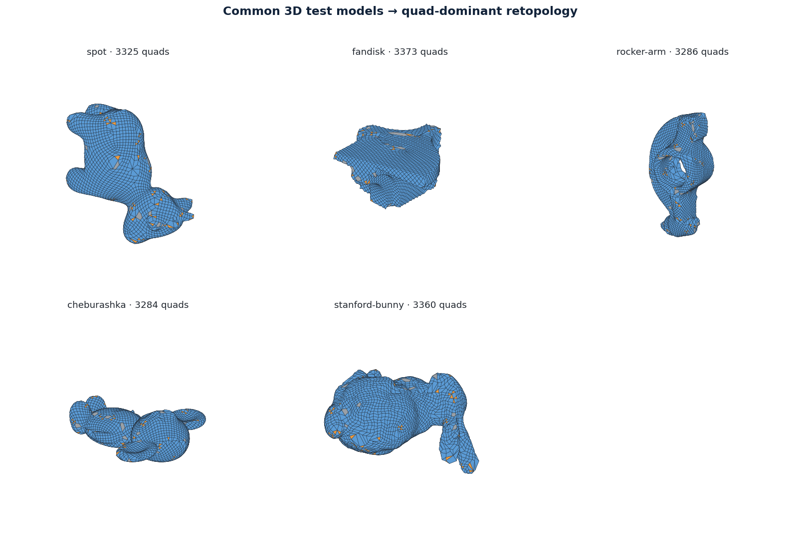
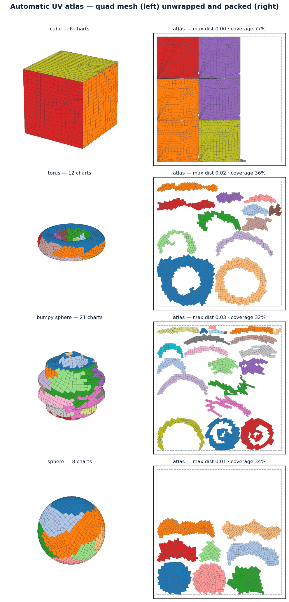
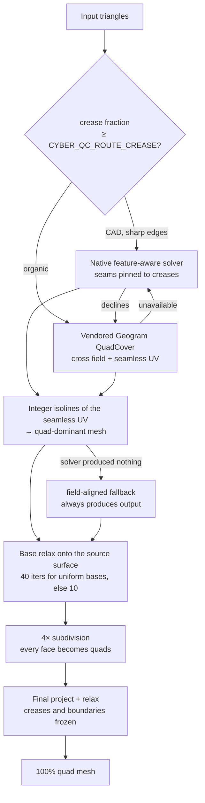
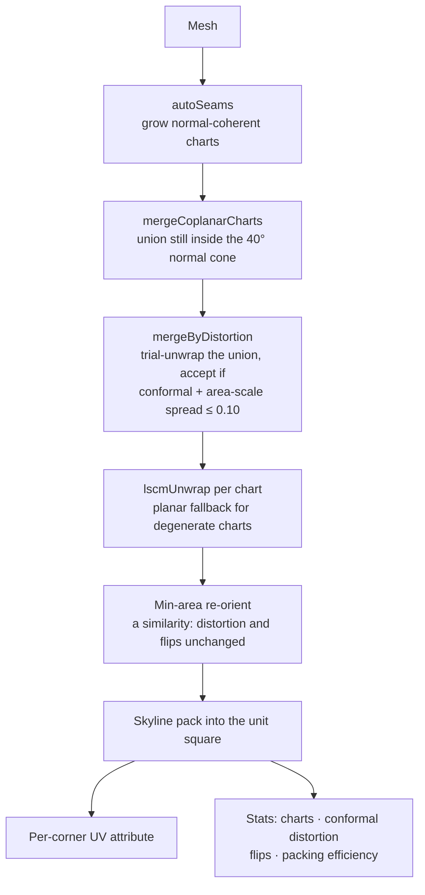

# CyberRemesher

Quad remeshing, stroke-based retopology, UV editing, and baking — one pure C++20 engine for
desktop and mobile, with CPU/CUDA/OpenCL/Metal compute backends.

Re-implements and improves on [AutoRemesher](https://github.com/huxingyi/autoremesher)
(automatic field-guided quad remeshing) and the workflow pioneered by CozyBlanket
(manual retopology / UV / bake on tablets). Specifications live in [`openspec/`](openspec/) —
see `openspec/changes/bootstrap-v1-platform/` for the founding change (proposal, design,
capability specs, task plan).

### Auto-retopology

Triangle→quad remeshing via `RemeshParams.quad_method`, clean-room and permissively
licensed. The default **`quad-cover`** — a QuadCover seamless-UV isoline extractor —
**beats [QuadriFlow](https://github.com/hjwdzh/QuadriFlow) on both median quad angle
and irregular-vertex count** on 3 of the 5 corpus models (spot, rocker-arm,
stanford-bunny), losing fandisk and cheburashka, and routes crease-heavy CAD parts
to a feature-aware solver. It is at least as topologically valid as QuadriFlow on
all 5, and stays manifold on flat CAD input where QuadriFlow tears. Other
strategies: **`field-aligned`** (max-matching over a smoothed cross field, ~95%+
quad-dominance, strongest on box/CAD geometry), **`instant-meshes`** (Instant-Meshes-style
position-field extractor), and **`integer`** (experimental integer parametrization).



<sub>Real scanned / CAD models → quad-dominant retopology · <code>examples/09_test_models.py</code></sub>

Every strategy feeds a pure-quad path (subdivision + surface-projected relaxation)
for a 100%-quad result. `examples/10_vs_reference.py` and `examples/11_benchmark.py`
score the output side-by-side against QuadriFlow and AutoRemesher — e.g. the
stanford-bunny at ~3000 quads: median **83° / 3% irregular** vs QuadriFlow's
82° / 4% and AutoRemesher's 74° / 13%. GPL sources (AutoRemesher, its QuadCover/CoMISo path) were
idea references only, never copied — see [`THIRD_PARTY_NOTICES.md`](THIRD_PARTY_NOTICES.md).

### Automatic UV atlas

Beyond the interactive UV editor (hand-drawn seams, LSCM unwrap, packing,
distortion overlay), the engine has a one-call automatic path: `Mesh.unwrap_atlas`
(C: `cyber_uv_atlas`). It seams the mesh into normal-coherent charts, merges
adjacent charts (first any that still share a normal cone — free, no distortion
rise; then a looser distortion-bounded pass that folds developable regions
together, e.g. a cube's six faces into two flat strips), LSCM-unwraps each chart
conformally, re-orients each chart to its minimum-area bounding box, skyline-packs
them into the unit square, and writes the per-corner UV attribute —
mesh in, packed atlas out, no manual seams. It returns chart count, conformal
(angle) distortion, flip count and packing efficiency — where `packed_area` is
the fraction of the UV square the chart *geometry* covers (the bounding-box
fraction is reported separately as `packed_box_area`). On the remeshed quad output
it holds angular distortion under ~0.05 (conformal error, 0 = angle-preserving)
with no flipped charts; min-area re-orientation roughly doubles usable coverage on
box-like meshes (45°-diamond faces → axis-aligned squares). `examples/14_uv_atlas.py`
renders the quad mesh next to its packed atlas, tinted by chart, and
`examples/15_uv_vs_xatlas.py` benchmarks it against [xatlas](https://github.com/jpcy/xatlas)
(the open reference): CyberRemesher matches or beats xatlas on chart count while
holding ~2× lower conformal distortion; xatlas's polygon packer still fits its
charts tighter (higher coverage), the one remaining gap.



<sub>Each quad mesh (left) auto-seamed, unwrapped, re-oriented, and packed into a UV atlas (right), tinted by chart · <code>examples/14_uv_atlas.py</code></sub>

### Auto-routed seam paths

Between "draw every seam edge by hand" and "let the atlas decide" sits the UV
Path tool (`SeamPath` in Python/Swift, `cyber_seam_path_*` in C). You place
waypoints; the engine routes a least-cost edge path between consecutive ones
with a cost model that discounts feature-tagged and concave (valley) edges, so
a two-click hop **follows the groove** instead of cutting the geodesic shortcut
across flat surface. This is what makes seaming spiral-looped auto-retopo
output tractable — exactly the layouts where no traceable edge loop exists.

The pending path stays editable: any waypoint can be dragged
(`move_waypoint_to` snaps it to the nearest vertex) or deleted, and an edit
re-routes **only the segments adjacent to it** — the rest of the path keeps its
route, and each segment's `segment_revision` counter tells a viewport exactly
what to redraw. `commit` marks the route into a `SeamSet` — the one seam model,
the same `mark`/`erase`/`sew` set a hand-drawn seam edits, so in C++ island
computation, unwrap and stitch treat a routed seam exactly like a hand-marked
one (note that those three consume a seam set only in C++ today: the bindings
expose the set and the path, not island/unwrap/stitch over it) — and arms a
resume marker so the next waypoint continues from the
last committed point. Committing returns the edge ids it newly marked: that
list is the undo record (`revert_commit`), and edges that were already seams
are never in it, so they survive the undo. Dropping the resume marker only
forgets where to continue; it never touches a committed seam.

```python
seams, path = SeamSet(), SeamPath(mesh)
path.add_waypoint(a); path.add_waypoint(b)
path.move_waypoint_to(1, (x, y, z), radius=0.5)   # re-routes one segment
undo = path.commit(seams)                          # -> newly seamed edge ids
```

### Per-DCC export presets

`--preset` turns a run into a ready-to-hand-off bundle instead of a bare mesh:
remesh → auto-UV → bake the preset's map set → write the mesh and its maps under
the preset's naming, color-space and normal conventions.

```sh
cyberremesh --input sculpt.obj --output out/hero.obj --preset blender \
            --report out/report.json
# out/hero.obj  hero_normal.png  hero_ao.png  hero_curvature.png  hero_color.png
```

Four built-ins ship — `blender`, `unity`, `unreal`, `gltf-generic` (list them
with `--list-presets`). They differ where the target apps actually differ: only
`unreal` uses the DirectX green-channel convention (green points down), and only
`gltf-generic` drops curvature, because glTF 2.0 core has no slot for it. Color
is the one sRGB-encoded map in every preset; normal, AO and curvature carry data,
not appearance, and a gamma curve on them is a bug in every target app.

A preset is versioned JSON, so `--preset ./mine.json` behaves exactly like a
built-in:

```json
{ "schemaVersion": 1, "name": "mine", "resolution": 2048,
  "namingPattern": "{basename}_{map}.{ext}",
  "maps": ["normal", "ao", {"map": "color", "colorSpace": "srgb", "suffix": "basecolor"}] }
```

A preset declaring a schema version this engine does not support is rejected by
name, and a field the engine does not recognise is an error rather than a silent
drop — a preset that quietly loses the field you added is worse than one that
refuses to load. The JSON report records the effective preset and every file
produced.

The same thing from Python, without the CLI (C ABI: `cyber_export_preset_*` and
`cyber_export_bundle_write`):

```python
from cyberremesh import ExportPreset, builtin_presets, write_bundle

builtin_presets()                                  # ['blender', 'unity', ...]
with ExportPreset.resolve("unreal") as preset:     # or a path to your JSON
    preset.resolution = 1024                       # == --texture-size
    preset.normal_green                            # '-Y' — Unreal reads DirectX
    result = write_bundle(low, high, preset, "out/hero.glb")
result.files                                       # mesh + one per baked map
```

Listing, resolving and reading a preset works in every build; only
`write_bundle` needs the UV-gated bundle module, and says so where it is absent.

**Cost:** the AO bake dominates a preset run — about 96% of it — and scales with
texel count, so the default 2048² map set takes minutes on a desktop CPU. Use
`--texture-size` (and `--ao-samples`) to trade resolution for time; parallelising
the bake's texel loop is the open follow-up.

## Sculpt handoff bridge

The pipeline story is `sculpt -> retopo -> UV -> bake` in one place. This engine
owns the second half, and takes the first half's output through a **versioned
interchange** rather than a library dependency: there is **no build or link
dependency on any sculpting or volumetric engine**, and there never will be —
the format and the evaluator interface are the only coupling points.

```sh
# One command: sculpt handoff in, low-poly plus maps out.
cyberremesh --target sculpt.ply --output low.obj \
            --preset blender --bake normal,ao,curvature --report run.json

# Or straight off a producer's stdout.
producer --for-retopo | cyberremesh --target - --output low.obj --preset blender
```

`run.json` gains a `handoff` block recording the declared version, the producer
label, and which optional payloads (vertex colors, normals, material mix) were
present. A handoff declaring a version this engine does not support is **exit 3
naming both versions**, and writes nothing — a newer minor is refused rather
than read with the unknown parts dropped.

The format — a PLY profile carrying positions, normals, vertex colors and a
`material_mix` weight, plus a GLB profile and an in-memory buffer profile — is
specified in [`docs/sculpt-handoff-format.md`](docs/sculpt-handoff-format.md).
`examples/18_sculpt_handoff.py` is a working synthetic producer end to end. From
Python, `Mesh.load_handoff` takes the file profile and
`Mesh.load_handoff_buffers` the in-memory one — an in-process producer needs no
temporary file, and gets the same version gate either way.

PLY and the buffer profile are the proven paths. The `.gltf`/`.glb` route is
accepted and version-gated but carries geometry only today: the declared
producer label is not read back and vertex normals do not reach the Target, so
prefer PLY when either matters.

Two more pieces ride on the same "no hard dependency" rule:

- **Field-sampled baking.** `cyber::bake::FieldEvaluator` is a pure-abstract
  interface (signed distance, gradient, occlusion, curvature). Attach one to a
  bake and normal/AO/curvature/cavity sample the field directly — the cage ray
  is sphere-traced through it and normals come from exact gradients instead of
  interpolated mesh normals, with no Target mesh needed at all. Without one,
  baking takes the raycast path with **bit-identical** output. Reachable from
  C++ (`BakeParams::field`), the C ABI (`cyber_bake_field`) and Python
  (`cyberremesh.FieldEvaluator` + `bake_field`).
- **Conform.** When the sculpt changes after retopology has started,
  `cyber::retopo::conform` (`cyber_conform`, `cyberremesh.conform`) re-snaps the
  EditMesh onto the new Target preserving its topology exactly, and reports the
  **maximum and RMS deviation** plus any vertices past a caller-set threshold.
  It completes and flags rather than silently stretching.

## How it works

Two algorithms carry the project: the quad retopology pipeline (triangles in, an
all-quad mesh out) and the automatic UV atlas (a mesh in, a packed chart layout
out). Both are described here at the level of "what each stage is for" — the
authoritative detail lives in [`openspec/`](openspec/) and the sources named below.

### Quad retopology

The idea in one line: **don't chase quads directly — solve for a smooth field of
directions over the surface, integrate it into a seamless UV, and read the quads
off that UV's integer isolines.** Where the field can't be combed flat, it pinches
into a *singularity* (a valence-3 or -5 vertex); those are unavoidable on curved
closed surfaces, and a good algorithm is one that produces few of them and puts
them where curvature already wanted them.


```mermaid
flowchart TD
    A[Input triangles] --> B{crease fraction<br/>≥ CYBER_QC_ROUTE_CREASE?}
    B -- "CAD, sharp edges" --> N[Native feature-aware solver<br/>seams pinned to creases]
    B -- "organic" --> V[Vendored Geogram QuadCover<br/>cross field + seamless UV]
    N -- declines --> V
    V -- unavailable --> N
    N --> ISO[Integer isolines of the seamless UV<br/>→ quad-dominant mesh]
    V --> ISO
    ISO -- solver produced nothing --> FB[field-aligned fallback<br/>always produces output]
    ISO --> R1
    FB --> R1
    R1[Base relax onto the source surface<br/>40 iters for uniform bases, else 10] --> S[4× subdivision<br/>every face becomes quads]
    S --> R2[Final project + relax<br/>creases and boundaries frozen]
    R2 --> OUT[100% quad mesh]
```

Stage by stage:

1. **Backend routing.** `computeSeamlessUv` measures `creaseEdgeFraction` — the
   share of interior edges sharper than 45°. Crease-heavy CAD parts go to the
   native feature-aware solver first (it pins seams to the creases so loops follow
   the hard edges); everything else goes to the vendored in-process Geogram
   QuadCover field first, which wins on organic geometry. Either side falls back to
   the other, so a decline is never a failure. `CYBER_QC_NO_ROUTE` disables the
   routing, `CYBER_QC_DEBUG` traces the decision.
2. **Seamless UV.** The solver builds a smooth cross field, cuts the surface along
   seams, and solves for a UV parametrization whose transitions across those seams
   are rotations by multiples of 90° plus integer translations. That "seamless"
   property is exactly what makes the UV grid line up across the cut.
3. **Isoline extraction.** Tracing the integer isolines of that UV and intersecting
   them yields the quad mesh. Field singularities become the irregular vertices.
   A graph-cleanup pass then merges the redundant samples left along each isoline;
   without it every cell traces as an n-gon. On a **closed** surface that pass runs
   by default. On an **open** one it is still opt-in (`CYBER_QC_OPEN_CLEANUP`,
   experimental) because it is only half-built: it no longer fills the surface's
   own rim, but the graph simplification can still merge genuine boundary corners.
   The win it is chasing is large — on an open paraboloid, median 50° → 80°.
4. **Pure-quad path.** The extracted mesh is relaxed onto the original surface
   (longer for the uniform quad-cover/integer bases, which tolerate it — see
   `CYBER_BASE_RELAX_ITERS`), subdivided 4× so any residual triangle or pentagon
   becomes quads, then projected and relaxed once more. Feature and boundary
   vertices are frozen throughout, so relaxation never rounds off a crease.

Sources: `src/quadrangulate/src/quadcover_extractor.cpp` (routing and both
solvers), `src/core/src/pipeline.cpp` (stage orchestration and the relax levers).

### Automatic UV atlas

The idea in one line: **grow charts that are already nearly flat, merge them as
aggressively as a distortion budget allows, unwrap each one conformally, then pack
the results.** Fewer, larger charts mean fewer seams for the artist and less
wasted texel area — the merge passes are where most of the quality comes from.


```mermaid
flowchart TD
    M[Mesh] --> S[autoSeams<br/>grow normal-coherent charts]
    S --> C[mergeCoplanarCharts<br/>union still inside the 40° normal cone]
    C --> D[mergeByDistortion<br/>trial-unwrap the union, accept if<br/>conformal + area-scale spread ≤ 0.10]
    D --> L[lscmUnwrap per chart<br/>planar fallback for degenerate charts]
    L --> O[Min-area re-orient<br/>a similarity: distortion and flips unchanged]
    O --> P[Skyline pack into the unit square]
    P --> U[Per-corner UV attribute]
    P --> ST[Stats: charts · conformal distortion<br/>flips · packing efficiency]
```

Stage by stage:

1. **Seam.** `autoSeams` grows charts from seed faces, adding neighbours whose
   normals stay inside a cone (`maxChartAngleDeg`, default 40°). Cheap, and it
   never produces a chart that is wildly non-developable.
2. **Free merge.** `mergeCoplanarCharts` unions adjacent charts whose combined
   normals *still* fit the cone. Distortion cannot rise, so this pass is pure win.
3. **Budgeted merge.** `mergeByDistortion` is the looser pass: it actually
   LSCM-unwraps the candidate union and accepts only if the result stays under
   `maxChartDistortion`. The acceptance test is conformal (angle) error **plus an
   area-scale spread term** — angle error alone is ~0 for a cube's flat facets and
   would happily fold the whole cube into one badly stretched chart. This is what
   folds a cube's six faces into two strips.
4. **Unwrap and orient.** Each surviving chart gets an LSCM conformal unwrap, then
   is rotated to its minimum-area bounding box. That rotation is a similarity, so
   distortion and flip counts are untouched — it just roughly doubles usable
   coverage on box-like meshes (45° diamonds become axis-aligned squares).
5. **Pack.** Skyline packing into the unit square, then the per-corner UV attribute
   and the reported stats.

Source: `src/uv/src/atlas.cpp` (`greedyMergeCharts` is the shared fixpoint driver
behind both merge passes).

## Layout

```
apps/            desktop shell, mobile shells, headless CLI
src/app/         document model, tools, undo (toolkit-free)
src/render/      viewport renderer (Metal | Vulkan)
src/accel/       compute backends: cpu | metal | cuda | opencl
src/core/        mesh kernel, io, remeshing pipeline, uv, bake
src/handoff/     versioned sculpt-handoff ingest (pipeline bridge)
tests/           unit + property + golden regression tests
thirdparty/      vendored permissive dependencies (manifest.json)
```

## Build

Requires CMake ≥ 3.24, Ninja, and a C++20 compiler. A [`just`](https://github.com/casey/just)
task runner mirrors the sibling CyberdyneCorp libraries (SciPP / NumPP):

```sh
just build      # configure + build (library, CLI, tests)
just test       # build + run the full suite
just debug      # ASan/UBSan build
just gcc        # build + test with GCC
just spec       # validate the OpenSpec changes
just ci         # local CI: test + gcc + spec
just gpu-detect # probe CUDA / OpenCL / Metal
just clean      # remove build dirs
```

`just` is a thin wrapper over the CMake presets, which you can also drive directly:

```sh
cmake --preset cpu-headless      # core + accel + CLI + tests, no GPU SDK needed
cmake --build --preset cpu-headless
ctest --preset cpu-headless
```

Other presets: `cpu-headless-debug` (ASan/UBSan), `macos-metal`, `linux-cuda`,
`windows-cuda`, `ios`, `android`.

The `cpu-headless` preset requests `-DCYBER_WITH_QUADCOVER=ON`, which vendors and
compiles an in-process Geogram QuadCover solver (~102 sources, a one-time build
cost). That is the field that lets the default `quad-cover` quadrangulator **beat
QuadriFlow on median quad angle and irregular-vertex count** on organic meshes. It
needs **OpenMP + TBB**; where they are absent (a minimal CI runner, a macOS box
without `libomp`) the build **auto-falls-back to the dependency-free native
seamless-UV solver** (a few degrees lower median, still fully functional and
portable) — so `-DCYBER_WITH_QUADCOVER=ON` never hard-fails. Override with
`-DCYBER_WITH_QUADCOVER=OFF` to skip it outright; mobile presets (`ios`/`android`)
leave it off.

### Use as a library

`just install` (or `cmake --install`) installs a `find_package(CyberRemesher)`
CONFIG package — the self-contained C ABI shared library plus its header. Consume
it from another CMake project the same way as the sibling CyberdyneCorp libraries:

```cmake
find_package(CyberRemesher CONFIG REQUIRED)
target_link_libraries(your_app PRIVATE cyber::capi)   # + #include <cyber_capi.h>
```

The `cyber::capi` target carries the include path and links the versioned
`libcyber_capi.so`; the C++ core, quadrangulator, UV, and the in-process Geogram
solver are all baked into it, so the package has no transitive dependencies. In
the same build tree, `add_subdirectory()` also exposes the `cyber::*` targets
(`cyber::core`, `cyber::uv`, …). Python bindings live in `python/cyberremesh/`.

## Development

- Specs first: medium/large changes go through OpenSpec (`openspec list`).
- `python3 tools/license_audit.py` — dependency license gate (permissive only).
- `.clang-format` / `.clang-tidy` are enforced in CI.
